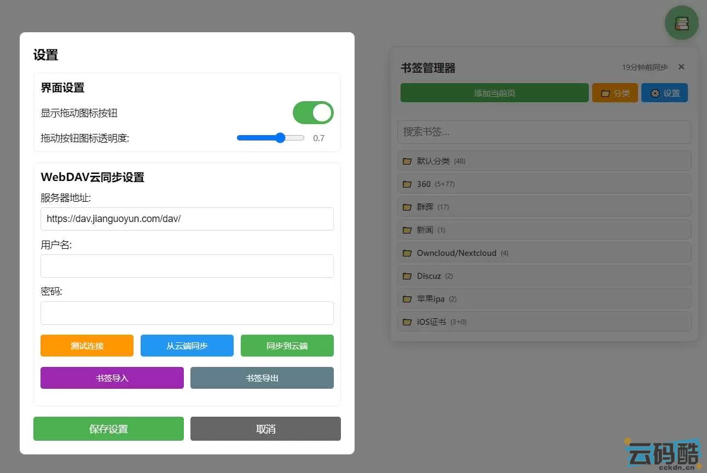
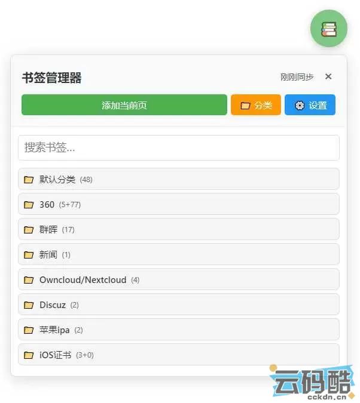
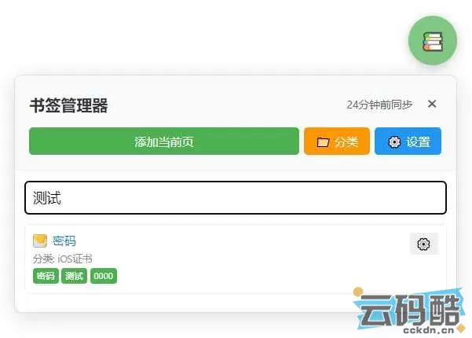
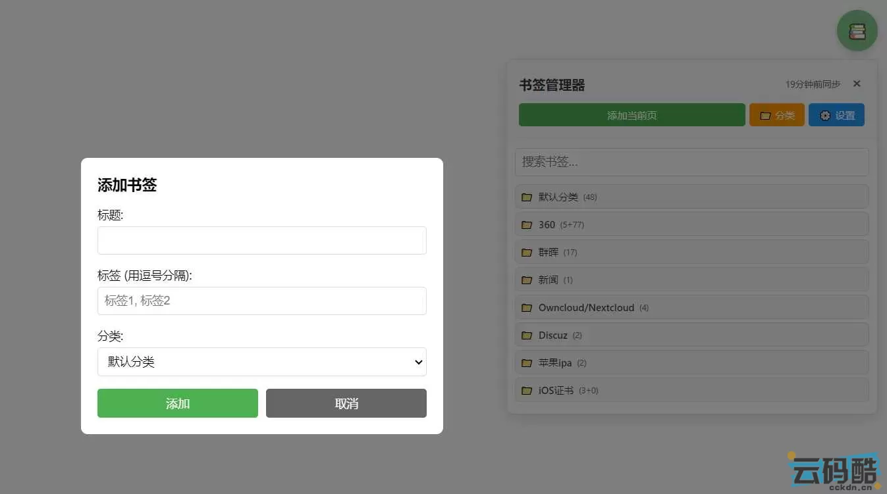
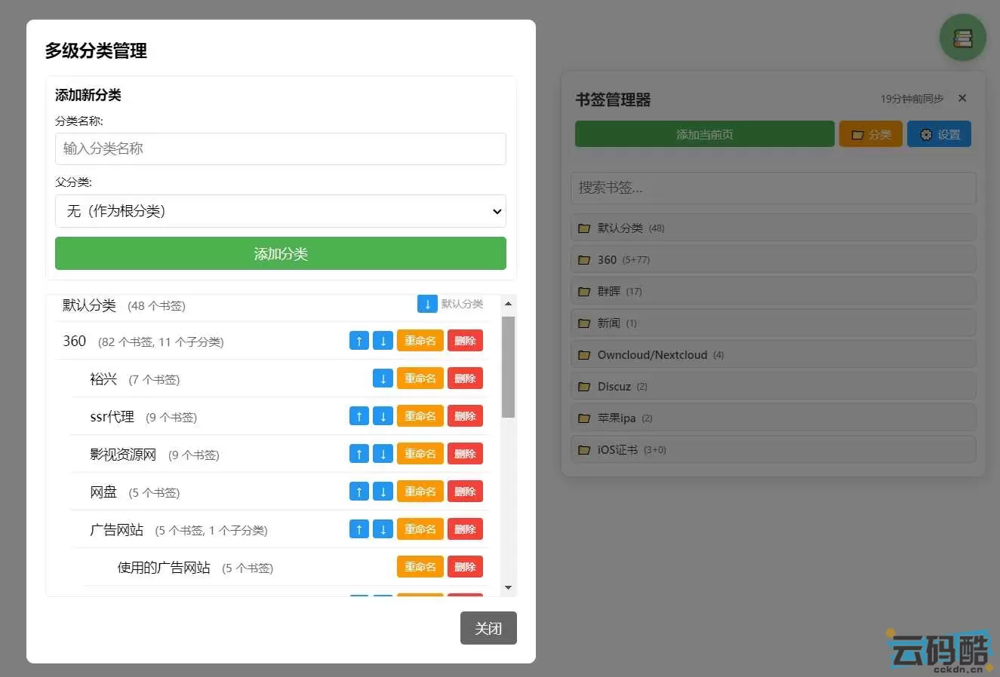

# WebDAV-Bookmark
基于 WebDAV 协议的跨设备网络书签管理器，支持书签管理、跨浏览器多平台（iPhone、Android、windows）同步及 WebDAV 云端数据备份。 
A cross device network bookmark manager based on the WebDAV protocol, supporting bookmark management, cross browser and multi platform (iPhone, Android, Windows) synchronization, and WebDAV cloud data backup.

# WebDAV-Bookmark
基于 WebDAV 协议的跨设备网络书签管理器，支持书签管理、跨浏览器多平台（iPhone、Android、windows）同步及 WebDAV 云端数据备份。 
A cross device network bookmark manager based on the WebDAV protocol, supporting bookmark management, cross browser and multi platform (iPhone, Android, Windows) synchronization, and WebDAV cloud data backup.

## 网络书签管理器（WebDAV 云同步版）：跨端通用 + 自主存储的书签管理神器

在多设备协同成为常态的今天，浏览器自带的书签功能往往受限于 “单端存储、分类简陋、同步繁琐、数据安全无保障” 等问题 —— 电脑端收藏的网页在手机上找不到，手机保存的链接无法同步到平板，大量书签杂乱无章难以检索，更担心第三方平台泄露或丢失书签数据。而这款「网络书签管理器（WebDAV 云同步版）」脚本，正是为解决这些痛点而生：它基于 Tampermonkey 插件运行，完美适配电脑端、安卓端、iPhone 端，以 “自主 WebDAV 存储 + 跨端云同步” 为核心，数据全程保存在自己的 WebDAV 服务器中，安全放心，同时整合多级分类、批量管理、导入导出等实用功能，让书签管理跨越设备边界，既高效省心又安全可控。

## 全端适配，无缝覆盖你的所有设备

## 电脑端（Windows/Mac/Linux）：
兼容 Chrome、Edge、Firefox 等主流浏览器，搭配 Tampermonkey 插件即可启用。浮动按钮可自由拖动定位，面板布局清晰，支持批量操作和快捷键调用，适配办公场景下的高效书签管理需求，无论是整理工作资料还是收藏学习链接都游刃有余。

## 安卓端：
支持 狐猴 浏览器等 完整支持Tampermonkey 的移动端浏览器，界面自动适配手机屏幕，触摸操作流畅。通勤时收藏网页、户外查阅书签、随时同步电脑端的工作链接，都能轻松应对，无需反复切换设备查找。

## iPhone 端：
可通过 Stay 浏览器插件（可让Safari浏览器支持油猴脚本） 或 支持油猴脚本的 Alook 浏览器、Mercury 浏览器等应用安装使用，深度适配 iOS 系统的交互逻辑，按钮大小、字体间距优化适配触屏操作，完美解决苹果生态下书签同步难、存储不安全的痛点，让 iPhone 用户也能享受跨端书签管理的便捷。

## 自主 WebDAV 存储，数据安全完全掌控

区别于依赖第三方平台的书签工具，这款脚本将所有书签数据以标准 HTML 格式存储在你自己信任的 WebDAV 服务器中（支持坚果云、Nextcloud、自建 WebDAV 等），数据传输全程加密，无第三方介入，不用担心书签泄露、丢失或被平台限制访问。无论是重要的工作链接、私密的学习资料，还是珍贵的收藏内容，都能牢牢掌握在自己手中，安全又放心。

## 这些人群，最值得入手使用

## 多设备办公族：
经常在电脑、手机、平板间切换工作，需要书签跨端实时同步，避免重复收藏、找不到链接的麻烦，同时注重工作数据的安全性；

## 重度网络使用者：
日常浏览大量资讯、学习资料、工作链接，需要多级分类（如 “工作 / 项目 A”“学习 / 编程”“生活 / 旅行”）让书签井然有序，还能通过搜索快速定位；

## 数据安全重视者：
不满足于第三方平台的存储服务，希望通过自主 WebDAV 服务器实现书签备份与跨平台同步，双重保障数据不泄露、不丢失；

## 高效管理需求者：
需要批量整理、快速搜索、导入导出书签，或经常迁移浏览器书签的用户，告别手动逐一操作的繁琐，大幅提升管理效率；

## 跨平台浏览器用户：
同时使用多款浏览器（如电脑用 Chrome、手机用 Safari/Alook），需要统一的书签管理入口，打破浏览器与设备间的壁垒，实现书签一站式管理。

# 操作界面展示：

# 网络书签管理器（WebDAV云同步版）核心功能速查清单

<!-- 基础样式：内联到每个元素，替代全局style -->

## 一、基础书签操作

<table style="width: 100%; border-collapse: collapse; background: #fff;">
    <thead>
        <tr>
            <th style="padding: 12px 15px; text-align: left; border: 1px solid #e0e0e0; background-color: #e8f4fd; color: #2c3e50; font-weight: 600; white-space: nowrap;">功能</th>
            <th style="padding: 12px 15px; text-align: left; border: 1px solid #e0e0e0; background-color: #e8f4fd; color: #2c3e50; font-weight: 600; white-space: nowrap;">操作入口</th>
            <th style="padding: 12px 15px; text-align: left; border: 1px solid #e0e0e0; background-color: #e8f4fd; color: #2c3e50; font-weight: 600; white-space: nowrap;">关键步骤</th>
        </tr>
    </thead>
    <tbody>
        <tr style="background-color: #fff;">
            <td style="padding: 12px 15px; text-align: left; border: 1px solid #e0e0e0;">添加当前页书签</td>
            <td style="padding: 12px 15px; text-align: left; border: 1px solid #e0e0e0;">1. 浮动按钮📚→点击→添加当前页； 2. 菜单命令→添加当前页面到书签</td>
            <td style="padding: 12px 15px; text-align: left; border: 1px solid #e0e0e0;">填写标题/标签→选择分类→确认添加</td>
        </tr>
        <tr style="background-color: #f9f9f9;">
            <td style="padding: 12px 15px; text-align: left; border: 1px solid #e0e0e0;">编辑书签</td>
            <td style="padding: 12px 15px; text-align: left; border: 1px solid #e0e0e0;">书签卡片→⚙️设置→编辑</td>
            <td style="padding: 12px 15px; text-align: left; border: 1px solid #e0e0e0;">修改标题/URL/标签→保存</td>
        </tr>
        <tr style="background-color: #fff;">
            <td style="padding: 12px 15px; text-align: left; border: 1px solid #e0e0e0;">删除书签</td>
            <td style="padding: 12px 15px; text-align: left; border: 1px solid #e0e0e0;">1. 单个：书签卡片→⚙️设置→删除； 2. 批量：批量模式→勾选→批量删除</td>
            <td style="padding: 12px 15px; text-align: left; border: 1px solid #e0e0e0;">单个直接确认；批量勾选后点击“批量删除”→确认</td>
        </tr>
        <tr style="background-color: #f9f9f9;">
            <td style="padding: 12px 15px; text-align: left; border: 1px solid #e0e0e0;">移动书签分类</td>
            <td style="padding: 12px 15px; text-align: left; border: 1px solid #e0e0e0;">1. 单个：书签卡片→⚙️设置→移动； 2. 批量：批量模式→勾选→批量移动</td>
            <td style="padding: 12px 15px; text-align: left; border: 1px solid #e0e0e0;">选择目标分类→确认</td>
        </tr>
        <tr style="background-color: #fff;">
            <td style="padding: 12px 15px; text-align: left; border: 1px solid #e0e0e0;">搜索书签</td>
            <td style="padding: 12px 15px; text-align: left; border: 1px solid #e0e0e0;">主面板→搜索框</td>
            <td style="padding: 12px 15px; text-align: left; border: 1px solid #e0e0e0;">输入标题/URL/标签关键词，实时筛选</td>
        </tr>
    </tbody>
</table>

## 二、多级分类管理

<table style="width: 100%; border-collapse: collapse; background: #fff;">
    <thead>
        <tr>
            <th style="padding: 12px 15px; text-align: left; border: 1px solid #e0e0e0; background-color: #e8f4fd; color: #2c3e50; font-weight: 600; white-space: nowrap;">功能</th>
            <th style="padding: 12px 15px; text-align: left; border: 1px solid #e0e0e0; background-color: #e8f4fd; color: #2c3e50; font-weight: 600; white-space: nowrap;">操作入口</th>
            <th style="padding: 12px 15px; text-align: left; border: 1px solid #e0e0e0; background-color: #e8f4fd; color: #2c3e50; font-weight: 600; white-space: nowrap;">关键步骤</th>
        </tr>
    </thead>
    <tbody>
        <tr style="background-color: #fff;">
            <td style="padding: 12px 15px; text-align: left; border: 1px solid #e0e0e0;">创建分类</td>
            <td style="padding: 12px 15px; text-align: left; border: 1px solid #e0e0e0;">1. 主面板→📁分类； 2. 设置→分类管理</td>
            <td style="padding: 12px 15px; text-align: left; border: 1px solid #e0e0e0;">输入分类名称→选择父分类（可选）→添加分类</td>
        </tr>
        <tr style="background-color: #f9f9f9;">
            <td style="padding: 12px 15px; text-align: left; border: 1px solid #e0e0e0;">编辑分类名称</td>
            <td style="padding: 12px 15px; text-align: left; border: 1px solid #e0e0e0;">分类管理→目标分类→重命名</td>
            <td style="padding: 12px 15px; text-align: left; border: 1px solid #e0e0e0;">输入新名称→确认</td>
        </tr>
        <tr style="background-color: #fff;">
            <td style="padding: 12px 15px; text-align: left; border: 1px solid #e0e0e0;">调整分类顺序</td>
            <td style="padding: 12px 15px; text-align: left; border: 1px solid #e0e0e0;">分类管理→目标分类→↑上移/↓下移</td>
            <td style="padding: 12px 15px; text-align: left; border: 1px solid #e0e0e0;">点击上下箭头调整同级分类顺序</td>
        </tr>
        <tr style="background-color: #f9f9f9;">
            <td style="padding: 12px 15px; text-align: left; border: 1px solid #e0e0e0;">删除分类</td>
            <td style="padding: 12px 15px; text-align: left; border: 1px solid #e0e0e0;">分类管理→目标分类→删除</td>
            <td style="padding: 12px 15px; text-align: left; border: 1px solid #e0e0e0;">确认删除（子分类同步删除，书签移至默认分类）</td>
        </tr>
        <tr style="background-color: #fff;">
            <td style="padding: 12px 15px; text-align: left; border: 1px solid #e0e0e0;">展开/折叠分类</td>
            <td style="padding: 12px 15px; text-align: left; border: 1px solid #e0e0e0;">主面板→分类标题（📁/📂图标）</td>
            <td style="padding: 12px 15px; text-align: left; border: 1px solid #e0e0e0;">点击分类名称即可切换展开/折叠状态</td>
        </tr>
    </tbody>
</table>

## 三、WebDAV 云同步

<table style="width: 100%; border-collapse: collapse; background: #fff;">
    <thead>
        <tr>
            <th style="padding: 12px 15px; text-align: left; border: 1px solid #e0e0e0; background-color: #e8f4fd; color: #2c3e50; font-weight: 600; white-space: nowrap;">功能</th>
            <th style="padding: 12px 15px; text-align: left; border: 1px solid #e0e0e0; background-color: #e8f4fd; color: #2c3e50; font-weight: 600; white-space: nowrap;">操作入口</th>
            <th style="padding: 12px 15px; text-align: left; border: 1px solid #e0e0e0; background-color: #e8f4fd; color: #2c3e50; font-weight: 600; white-space: nowrap;">关键步骤</th>
        </tr>
    </thead>
    <tbody>
        <tr style="background-color: #fff;">
            <td style="padding: 12px 15px; text-align: left; border: 1px solid #e0e0e0;">配置同步参数</td>
            <td style="padding: 12px 15px; text-align: left; border: 1px solid #e0e0e0;">1. 主面板→⚙️设置； 2. 菜单命令→功能设置</td>
            <td style="padding: 12px 15px; text-align: left; border: 1px solid #e0e0e0;">填写服务器地址（如坚果云 dav.jianguoyun.com/dav/）、用户名、密码→保存</td>
        </tr>
        <tr style="background-color: #f9f9f9;">
            <td style="padding: 12px 15px; text-align: left; border: 1px solid #e0e0e0;">测试连接</td>
            <td style="padding: 12px 15px; text-align: left; border: 1px solid #e0e0e0;">设置页面→WebDAV 同步→测试连接</td>
            <td style="padding: 12px 15px; text-align: left; border: 1px solid #e0e0e0;">配置后点击 “测试连接”，提示 “连接成功” 即可使用</td>
        </tr>
        <tr style="background-color: #fff;">
            <td style="padding: 12px 15px; text-align: left; border: 1px solid #e0e0e0;">手动同步</td>
            <td style="padding: 12px 15px; text-align: left; border: 1px solid #e0e0e0;">1. 设置页面→从云端同步/同步到云端； 2. 菜单命令→立即同步</td>
            <td style="padding: 12px 15px; text-align: left; border: 1px solid #e0e0e0;">点击对应按钮，自动合并本地与云端数据</td>
        </tr>
        <tr style="background-color: #f9f9f9;">
            <td style="padding: 12px 15px; text-align: left; border: 1px solid #e0e0e0;">查看同步状态</td>
            <td style="padding: 12px 15px; text-align: left; border: 1px solid #e0e0e0;">主面板顶部→同步状态文本</td>
            <td style="padding: 12px 15px; text-align: left; border: 1px solid #e0e0e0;">显示 “刚刚同步”“X 分钟前同步” 等，未配置则显示 “未配置云同步”</td>
        </tr>
    </tbody>
</table>

## 四、导入导出功能

<table style="width: 100%; border-collapse: collapse; background: #fff;">
    <thead>
        <tr>
            <th style="padding: 12px 15px; text-align: left; border: 1px solid #e0e0e0; background-color: #e8f4fd; color: #2c3e50; font-weight: 600; white-space: nowrap;">功能</th>
            <th style="padding: 12px 15px; text-align: left; border: 1px solid #e0e0e0; background-color: #e8f4fd; color: #2c3e50; font-weight: 600; white-space: nowrap;">操作入口</th>
            <th style="padding: 12px 15px; text-align: left; border: 1px solid #e0e0e0; background-color: #e8f4fd; color: #2c3e50; font-weight: 600; white-space: nowrap;">关键步骤</th>
        </tr>
    </thead>
    <tbody>
        <tr style="background-color: #fff;">
            <td style="padding: 12px 15px; text-align: left; border: 1px solid #e0e0e0;">导入书签</td>
            <td style="padding: 12px 15px; text-align: left; border: 1px solid #e0e0e0;">1. 主面板→⚙️设置→书签导入； 2. 菜单命令→导入书签</td>
            <td style="padding: 12px 15px; text-align: left; border: 1px solid #e0e0e0;">选择浏览器导出的 HTML 书签文件→自动解析多级分类→去重后导入</td>
        </tr>
        <tr style="background-color: #f9f9f9;">
            <td style="padding: 12px 15px; text-align: left; border: 1px solid #e0e0e0;">导出书签</td>
            <td style="padding: 12px 15px; text-align: left; border: 1px solid #e0e0e0;">1. 主面板→⚙️设置→书签导出； 2. 菜单命令→导出书签</td>
            <td style="padding: 12px 15px; text-align: left; border: 1px solid #e0e0e0;">点击后自动下载 HTML 格式书签文件（文件名含时间戳）</td>
        </tr>
    </tbody>
</table>

## 五、批量管理功能

<table style="width: 100%; border-collapse: collapse; background: #fff;">
    <thead>
        <tr>
            <th style="padding: 12px 15px; text-align: left; border: 1px solid #e0e0e0; background-color: #e8f4fd; color: #2c3e50; font-weight: 600; white-space: nowrap;">功能</th>
            <th style="padding: 12px 15px; text-align: left; border: 1px solid #e0e0e0; background-color: #e8f4fd; color: #2c3e50; font-weight: 600; white-space: nowrap;">操作入口</th>
            <th style="padding: 12px 15px; text-align: left; border: 1px solid #e0e0e0; background-color: #e8f4fd; color: #2c3e50; font-weight: 600; white-space: nowrap;">关键步骤</th>
        </tr>
    </thead>
    <tbody>
        <tr style="background-color: #fff;">
            <td style="padding: 12px 15px; text-align: left; border: 1px solid #e0e0e0;">开启批量模式</td>
            <td style="padding: 12px 15px; text-align: left; border: 1px solid #e0e0e0;">1. 主面板→📋批量； 2. 书签卡片→⚙️设置→批量</td>
            <td style="padding: 12px 15px; text-align: left; border: 1px solid #e0e0e0;">点击后书签卡片显示勾选框，顶部显示批量操作栏</td>
        </tr>
        <tr style="background-color: #f9f9f9;">
            <td style="padding: 12px 15px; text-align: left; border: 1px solid #e0e0e0;">全选/全不选</td>
            <td style="padding: 12px 15px; text-align: left; border: 1px solid #e0e0e0;">批量模式→全选/全不选按钮</td>
            <td style="padding: 12px 15px; text-align: left; border: 1px solid #e0e0e0;">一键勾选当前显示的所有书签，或取消全部勾选</td>
        </tr>
        <tr style="background-color: #fff;">
            <td style="padding: 12px 15px; text-align: left; border: 1px solid #e0e0e0;">批量移动书签</td>
            <td style="padding: 12px 15px; text-align: left; border: 1px solid #e0e0e0;">批量模式→勾选书签→批量移动</td>
            <td style="padding: 12px 15px; text-align: left; border: 1px solid #e0e0e0;">选择目标分类→确认移动选中书签</td>
        </tr>
        <tr style="background-color: #f9f9f9;">
            <td style="padding: 12px 15px; text-align: left; border: 1px solid #e0e0e0;">批量删除书签</td>
            <td style="padding: 12px 15px; text-align: left; border: 1px solid #e0e0e0;">批量模式→勾选书签→批量删除</td>
            <td style="padding: 12px 15px; text-align: left; border: 1px solid #e0e0e0;">确认后永久删除选中书签（不可撤销）</td>
        </tr>
    </tbody>
</table>

## 六、安全验证与界面设置

<table style="width: 100%; border-collapse: collapse; background: #fff;">
    <thead>
        <tr>
            <th style="padding: 12px 15px; text-align: left; border: 1px solid #e0e0e0; background-color: #e8f4fd; color: #2c3e50; font-weight: 600; white-space: nowrap;">功能</th>
            <th style="padding: 12px 15px; text-align: left; border: 1px solid #e0e0e0; background-color: #e8f4fd; color: #2c3e50; font-weight: 600; white-space: nowrap;">操作入口</th>
            <th style="padding: 12px 15px; text-align: left; border: 1px solid #e0e0e0; background-color: #e8f4fd; color: #2c3e50; font-weight: 600; white-space: nowrap;">关键步骤</th>
        </tr>
    </thead>
    <tbody>
        <tr style="background-color: #fff;">
            <td style="padding: 12px 15px; text-align: left; border: 1px solid #e0e0e0;">密码验证</td>
            <td style="padding: 12px 15px; text-align: left; border: 1px solid #e0e0e0;">首次使用/每月首次打开面板时自动触发</td>
            <td style="padding: 12px 15px; text-align: left; border: 1px solid #e0e0e0;">微信扫码关注 “云码酷”→回复【开源】获取密码→输入验证</td>
        </tr>
        <tr style="background-color: #f9f9f9;">
            <td style="padding: 12px 15px; text-align: left; border: 1px solid #e0e0e0;">调整浮动按钮位置</td>
            <td style="padding: 12px 15px; text-align: left; border: 1px solid #e0e0e0;">桌面端：按住浮动按钮📚拖动； 移动端：长按拖动</td>
            <td style="padding: 12px 15px; text-align: left; border: 1px solid #e0e0e0;">拖动到目标位置，自动保存坐标</td>
        </tr>
        <tr style="background-color: #fff;">
            <td style="padding: 12px 15px; text-align: left; border: 1px solid #e0e0e0;">显示/隐藏浮动按钮</td>
            <td style="padding: 12px 15px; text-align: left; border: 1px solid #e0e0e0;">设置页面→界面设置→显示拖动图标按钮</td>
            <td style="padding: 12px 15px; text-align: left; border: 1px solid #e0e0e0;">勾选则显示，取消则隐藏（仍可通过菜单命令打开面板）</td>
        </tr>
        <tr style="background-color: #f9f9f9;">
            <td style="padding: 12px 15px; text-align: left; border: 1px solid #e0e0e0;">调整按钮透明度</td>
            <td style="padding: 12px 15px; text-align: left; border: 1px solid #e0e0e0;">设置页面→界面设置→透明度滑块</td>
            <td style="padding: 12px 15px; text-align: left; border: 1px solid #e0e0e0;">拖动滑块调整（0.1-1.0），实时预览效果</td>
        </tr>
    </tbody>
</table>

## 七、菜单命令快捷入口（Tampermonkey 菜单）
<ul style="margin: 10px 0; padding-left: 20px; line-height: 1.8;">
    <li style="margin: 8px 0; list-style: disc;">打开书签管理器：直接唤起主面板（需密码验证）</li>
    <li style="margin: 8px 0; list-style: disc;">添加当前页面到书签：快速添加当前网页，无需打开主面板</li>
    <li style="margin: 8px 0; list-style: disc;">导入/导出书签：直接触发导入/导出流程</li>
    <li style="margin: 8px 0; list-style: disc;">功能设置：快速进入配置页面</li>
    <li style="margin: 8px 0; list-style: disc;">立即同步：一键执行双向同步</li>
    <li style="margin: 8px 0; list-style: disc;">跳转到指定网页：打开工具相关网页（https://www.cckdn.cn）</li>
</ul>

